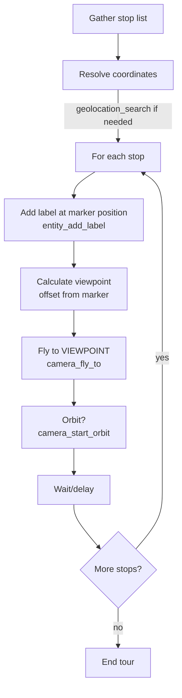

# Creating Globe Tours

## Overview

Coordinate Camera, Entity, and Clock MCP servers to create narrated flyover tours with multiple stops.

**Core principle:** A tour is a sequence of camera movements with optional annotations at each stop.

**Critical distinction — Marker vs. Viewpoint:**
- The **marker** (label, billboard, point) goes at the actual location coordinates.
- The **camera** flies to a **viewpoint** — a position offset from the marker so the marker and its surroundings are clearly visible.
- **Never fly the camera directly to the marker coordinates.** If you do, the camera lands on top of the marker and the user can't see it. Instead, position the camera at a distance and altitude that frames the marker well.

## When to Use

- User wants to "show" multiple locations in sequence
- Building a presentation or demo with geographic stops
- Creating a guided walkthrough of an area
- "Take me on a tour of..." or "fly through these places"

**When NOT to use:**
- Single location fly-to (just use camera_fly_to directly)
- Animating an entity along a route (use animating-journey-routes skill)
- Time-based playback (use time-lapse-visualizations skill)

## Planning Checklist

Before building, gather:
- [ ] List of stops (place names OR coordinates)
- [ ] Duration at each stop (default: 3-5 seconds)
- [ ] Labels/annotations needed? (Entity server)
- [ ] Orbit at key stops? (Camera server)
- [ ] Specific time of day/lighting? (Clock server)

## Workflow



## Viewpoint Positioning

When flying to a tour stop, you need TWO positions:

1. **Marker position** — where the label/entity is placed (at or near the actual location)
2. **Camera viewpoint** — where the camera flies to (offset so the marker is visible and framed well)

### How to Calculate a Good Viewpoint

| Marker Type | Camera Offset Strategy |
|-------------|----------------------|
| City/landmark | Place camera 0.01–0.05° away in lat/lon, 500–2000m altitude, pitch down 20–40° toward marker |
| Region/area | Place camera 0.1–0.5° away, 5000–20000m altitude, pitch down 30–50° |
| Building/POI | Place camera 0.005–0.01° away, 200–800m altitude, pitch down 25–45° |

**Rules of thumb:**
- **Altitude:** Higher camera = wider context. A good starting point is 3–5× the height of the tallest feature at the stop.
- **Lateral offset:** Shift the camera slightly (south is a good default preference) so the marker appears in the upper portion of the frame, which feels natural.
- **Heading:** Point the camera toward the marker. If the camera is south of the marker, heading ≈ 0° (north). If east, heading ≈ 270° (west). Calculate based on relative position.
- **Pitch:** Tilt down toward the marker. Values of -25° to -45° work well for most stops. Steeper pitch (-50° to -70°) for overhead/map-like views.

### Example: Marker at Eiffel Tower

```
Marker position:  { longitude: 2.2945,  latitude: 48.8584, height: 350 }
Camera viewpoint: { longitude: 2.2945,  latitude: 48.845,  height: 1200 }
                                                   ^^^^^^ offset south
Camera orientation: { heading: 0, pitch: -35, roll: 0 }
                                   ^^^^^^^^^^ looking down toward marker
```

The camera is ~1.5 km south and 1200m up, looking north and slightly down — giving a clear view of the tower and its label.

## Quick Reference

### Position Format (All Tools)
```json
{
  "longitude": -74.0060,
  "latitude": 40.7128,
  "height": 1000
}
```
**Note:** Longitude first, then latitude. Height in meters.

### Color Format (Entity Tools)
```json
{
  "red": 1.0,
  "green": 0.0,
  "blue": 0.0,
  "alpha": 1.0
}
```
**Note:** Values 0-1, not 0-255.

### Camera Easing Functions

| Effect | Easing | Use For |
|--------|--------|---------|
| Smooth professional | QUADRATIC_IN_OUT | Most tours |
| Dramatic arrival | CUBIC_IN | Hero locations |
| Gentle float | SINUSOIDAL_OUT | Scenic views |
| Quick snap | LINEAR_NONE | Fast transitions |

### Recommended Durations

| Distance | Duration |
|----------|----------|
| Same city | 2-3 seconds |
| Regional (100km) | 4-5 seconds |
| Continental | 6-8 seconds |
| Global | 10+ seconds |

### Orbit Settings

| Effect | Speed (rad/s) | Direction |
|--------|---------------|-----------|
| Slow dramatic | 0.002 | counterclockwise |
| Standard showcase | 0.005 | counterclockwise |
| Quick spin | 0.01 | clockwise |

**Orbit rules:**
- `camera_start_orbit` orbits from the **current camera state**. It preserves the existing position, heading, pitch, and range.
- **NEVER call `camera_look_at_transform` before `camera_start_orbit`** unless the user explicitly asks to change their viewing angle. `camera_look_at_transform` resets the camera orientation, which destroys the user's current view.
- If the user says "rotate" or "orbit," just call `camera_start_orbit` directly. That's it. Do not reposition or reorient the camera first.

## Example Tour Sequence

```javascript
// 1. Search for location (returns coordinates)
geolocation_search({ query: "Eiffel Tower, Paris" })
// Returns: { longitude: 2.2945, latitude: 48.8584, ... }

// 2. Add label at the ACTUAL location
entity_add_label({
  position: { longitude: 2.2945, latitude: 48.8584, height: 350 },
  label: {
    text: "Eiffel Tower",
    font: "24pt sans-serif",
    fillColor: { red: 1, green: 1, blue: 1, alpha: 1 },
    outlineColor: { red: 0, green: 0, blue: 0, alpha: 1 },
    outlineWidth: 2,
    style: "FILL_AND_OUTLINE"
  },
  id: "tour-label-paris"
})

// 3. Fly camera to a VIEWPOINT — NOT to the marker itself!
//    Camera is offset south of the marker and elevated, looking
//    north and downward so the Eiffel Tower label is clearly visible.
camera_fly_to({
  destination: { longitude: 2.2945, latitude: 48.845, height: 1200 },
  orientation: { heading: 0, pitch: -35, roll: 0 },
  duration: 5,
  easingFunction: "QUADRATIC_IN_OUT"
})

// 4. Start orbit (after fly_to completes)
camera_start_orbit({
  speed: 0.005,
  direction: "counterclockwise"
})

// 5. Wait, then stop orbit
camera_stop_orbit()

// 6. Continue to next stop...

// 7. Cleanup when done
entity_remove({ entityId: "tour-label-paris" })
```

## Common Mistakes

| Mistake | Fix |
|---------|-----|
| **Camera flies to marker coords** | **Offset the camera so the marker is IN VIEW, not under the camera. See Viewpoint Positioning above.** |
| **Using `camera_look_at_transform` before orbit** | **Just call `camera_start_orbit` directly — it preserves the current view. `camera_look_at_transform` resets the camera angle.** |
| Coordinates reversed | Use longitude first: `{ longitude, latitude, height }` |
| Colors as hex strings | Use object: `{ red: 1, green: 0, blue: 0, alpha: 1 }` |
| Flying too fast | Increase duration for long distances |
| Orbit won't stop | Call camera_stop_orbit() explicitly |
| Labels not visible | Check height is above terrain, increase font size |
| Forgetting cleanup | Track entity IDs and call entity_remove |

## Multi-Server Coordination

| Server | Role in Tours |
|--------|---------------|
| **Camera** | fly_to, start_orbit, stop_orbit, set_view |
| **Entity** | add_label, add_billboard, add_point, remove |
| **Clock** | Set time-of-day for lighting effects |
| **Geolocation** | search to resolve place names |

## Red Flags

- **Using the same coordinates for both the marker and the camera destination** — the camera must be offset to a viewpoint
- **Calling `camera_look_at_transform` before `camera_start_orbit`** — this destroys the user's current camera angle; just call orbit directly
- Starting tour without knowing all stop coordinates
- Not testing fly_to durations (too fast = disorienting)
- Leaving orbit running when moving to next stop
- Forgetting the globe is 3D (consider altitude and pitch)
